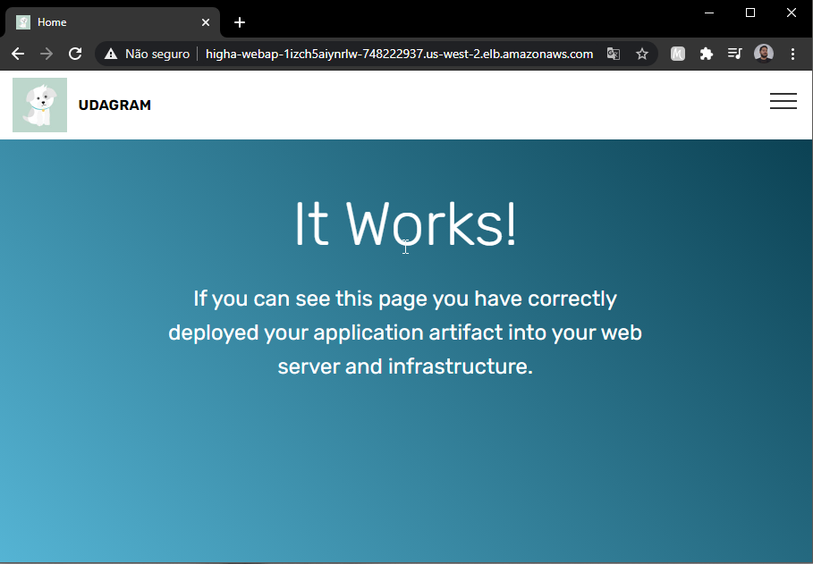

</div>

<h1 align="center">AWS Cloudformation</h1>

<p align="center">
  

  

  

  

</p>

<!-- Status -->

<!-- <h4 align="center">
	🚧  ConfiguringAWS_CLI 🚀 Under construction...  🚧
</h4>

<hr> -->

<p align="center">
  <a href="#dart-about">About</a> &#xa0; | &#xa0; 
  <a href="#sparkles-features">Features</a> &#xa0; | &#xa0;
  <a href="#rocket-technologies">Technologies</a> &#xa0; | &#xa0;
  <a href="#white_check_mark-requirements">Requirements</a> &#xa0; | &#xa0;
  <a href="#checkered_flag-starting">Starting</a> &#xa0; | &#xa0;
  <a href="#memo-license">License</a> &#xa0; | &#xa0;
  <a href="https://github.com/{{YOUR_GITHUB_USERNAME}}" target="_blank">Author</a>
</p>

<br>

## :dart: About

This is a script to deploy an RDS resource in AWS

## :sparkles: Features

:heavy_check_mark: Deploy a Hight Availability WebApp in AWS\
:heavy_check_mark: Add it in SecurityGroup\

## :rocket: Technologies

The following tools were used in this project:

- [AWS](https://aws.amazon.com/)
- [YAML](https://yaml.org/)

## :white_check_mark: Requirements

I suggest you know how to do by the console before you try deploy by code/template

## :checkered_flag: Starting

```bash
./create.sh webappnetwork networkWebApp.yaml networkWebApp-parameters.json
```

```bash
./create.sh HighAvailabilityWebApp servers.yml servers.json
```



## :memo: License

This project is under license from MIT. For more details, see the [LICENSE](LICENSE.md) file.

Made with :heart: by <a href="https://github.com/{{tecjeferson}}" target="_blank">{{tecjeferson}}</a>

&#xa0;

<a href="#top">Back to top</a>
